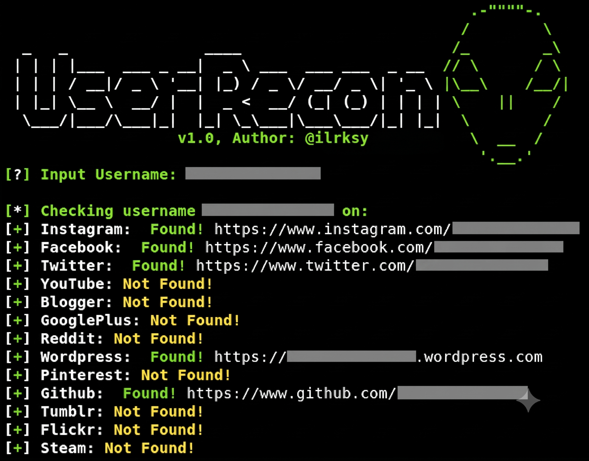

<p align="center">
  
</p>

<h1 align="center">UserRecon</h1>

<p align="center">
  <b>🔍 Find usernames across 75+ social networks — fast, simple, and effective.</b>
</p>

<p align="center">
  <a href="#installation"></a>
  <a href="./LICENSE"></a>
  <a href="#"></a>
  <a href="#"></a>
</p>

<p align="center">
  <a href="#features">Features</a> •
  <a href="#installation">Installation</a> •
  <a href="#usage">Usage</a> •
  <a href="#supported-platforms">Platforms</a> •
  <a href="#contributing">Contributing</a> •
  <a href="#license">License</a>
</p>

---

## 📖 About

**UserRecon** is an OSINT (Open Source Intelligence) tool that searches for a given username across **75+ social networks** simultaneously. It is designed for security researchers, penetration testers, and investigators who need to quickly determine if a username is registered on various platforms.

Results are displayed in real-time in the terminal and automatically saved to a `.txt` file for later analysis.

## ✨ Features

- 🔎 **75+ Platform Checks** — Scans across social media, developer platforms, music, art, and more
- ⚡ **Fast & Lightweight** — Pure Bash script with no heavy dependencies
- 💾 **Auto-Save Results** — All found profiles are exported to `<username>.txt`
- 🎨 **Color-Coded Output** — Green for found, yellow for not found — easy to read at a glance
- 🛡️ **OSINT Ready** — Built for reconnaissance and digital footprint analysis
- 🐧 **Cross-Distro** — Tested on Kali Linux, Parrot OS, Ubuntu, and more

## 📦 Installation

### Prerequisites

- **Bash** ≥ 4.0
- **curl** (usually pre-installed on most Linux distros)

### Quick Start

```bash
# Clone the repository
git clone https://github.com/ilrksy/UserRecon.git

# Navigate into the directory
cd UserRecon

# Make the script executable
chmod +x userrecon.sh

# Run UserRecon
./userrecon.sh
```

### One-Liner

```bash
git clone https://github.com/ilrksy/UserRecon.git && cd UserRecon && chmod +x userrecon.sh && ./userrecon.sh
```

## 🚀 Usage

```bash
./userrecon.sh
```

You will be prompted to enter a username:

```
[?] Input Username: targetuser
```

The tool will then check each platform and display results:

```
[*] Checking username targetuser on:
[+] Instagram:    Found! https://www.instagram.com/targetuser
[+] Facebook:     Not Found!
[+] Twitter:      Found! https://www.twitter.com/targetuser
[+] YouTube:      Not Found!
[+] GitHub:       Found! https://www.github.com/targetuser
...
[*] Saved: targetuser.txt
```

All discovered profiles are saved to `targetuser.txt` in the current directory.

## 🌐 Supported Platforms

<details>
<summary><b>Click to expand full list (75+ platforms)</b></summary>

| # | Platform | Category |
|---|----------|----------|
| 1 | Instagram | Social Media |
| 2 | Facebook | Social Media |
| 3 | Twitter / X | Social Media |
| 4 | YouTube | Video |
| 5 | Blogger | Blogging |
| 6 | Google Plus | Social Media |
| 7 | Reddit | Social Media |
| 8 | WordPress | Blogging |
| 9 | Pinterest | Social Media |
| 10 | GitHub | Developer |
| 11 | Tumblr | Blogging |
| 12 | Flickr | Photography |
| 13 | Steam | Gaming |
| 14 | Vimeo | Video |
| 15 | SoundCloud | Music |
| 16 | Disqus | Social Media |
| 17 | Medium | Blogging |
| 18 | DeviantART | Art & Design |
| 19 | VK | Social Media |
| 20 | About.me | Personal |
| 21 | Imgur | Media |
| 22 | Flipboard | News |
| 23 | SlideShare | Professional |
| 24 | Fotolog | Photography |
| 25 | Spotify | Music |
| 26 | MixCloud | Music |
| 27 | Scribd | Documents |
| 28 | Badoo | Dating |
| 29 | Patreon | Crowdfunding |
| 30 | BitBucket | Developer |
| 31 | DailyMotion | Video |
| 32 | Etsy | E-Commerce |
| 33 | CashMe | Finance |
| 34 | Behance | Art & Design |
| 35 | GoodReads | Books |
| 36 | Instructables | DIY |
| 37 | Keybase | Security |
| 38 | Kongregate | Gaming |
| 39 | LiveJournal | Blogging |
| 40 | AngelList | Professional |
| 41 | Last.fm | Music |
| 42 | Dribbble | Art & Design |
| 43 | Codecademy | Education |
| 44 | Gravatar | Personal |
| 45 | Pastebin | Developer |
| 46 | Foursquare | Social Media |
| 47 | Roblox | Gaming |
| 48 | Gumroad | E-Commerce |
| 49 | Newgrounds | Gaming |
| 50 | Wattpad | Writing |
| 51 | Canva | Art & Design |
| 52 | CreativeMarket | Art & Design |
| 53 | Trakt | Entertainment |
| 54 | 500px | Photography |
| 55 | Buzzfeed | News |
| 56 | TripAdvisor | Travel |
| 57 | HubPages | Blogging |
| 58 | Contently | Professional |
| 59 | Houzz | Lifestyle |
| 60 | blip.fm | Music |
| 61 | Wikipedia | Reference |
| 62 | Hacker News | Developer |
| 63 | CodeMentor | Developer |
| 64 | ReverbNation | Music |
| 65 | Designspiration | Art & Design |
| 66 | Bandcamp | Music |
| 67 | ColourLovers | Art & Design |
| 68 | IFTTT | Automation |
| 69 | eBay | E-Commerce |
| 70 | Slack | Communication |
| 71 | OkCupid | Dating |
| 72 | Trip (Skyscanner) | Travel |
| 73 | Ello | Social Media |
| 74 | Tracky | Social Media |
| 75 | TripIt | Travel |
| 76 | Basecamp | Professional |

</details>

## ⚠️ Disclaimer

> **This tool is intended for legal and authorized use only.** UserRecon is designed for OSINT research, penetration testing, and security auditing with proper authorization. The author is **not responsible** for any misuse or illegal activities conducted with this tool. Always ensure you have proper authorization before investigating any individual.

## 🤝 Contributing

Contributions are welcome! Here's how you can help:

1. **Fork** the repository
2. **Create** a feature branch (`git checkout -b feature/new-platform`)
3. **Commit** your changes (`git commit -m 'Add new platform check'`)
4. **Push** to the branch (`git push origin feature/new-platform`)
5. **Open** a Pull Request

### Ideas for Contribution

- Add new platform checks
- Fix false-positive/false-negative detections
- Improve error handling and timeout management
- Add parallel/async scanning for faster results
- Add command-line argument support (non-interactive mode)

## 📝 License

This project is licensed under the **GNU General Public License v3.0** — see the [LICENSE](./LICENSE) file for details.

Original concept by [@ilrksy](https://github.com/ilrksy). 

---

<p align="center">
  <b>⭐ Star this repo if you find it useful!</b><br>
  <sub>Made with ❤️ for the OSINT community</sub>
</p>
